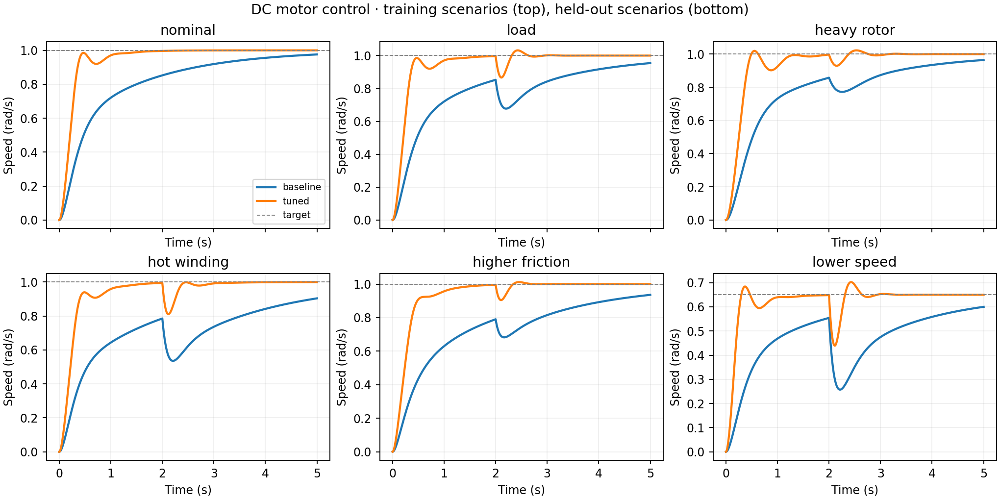

# Motor Control Lab

A reproducible experiment in motor physics, sampled control, and numerical
optimization. Compare a simple PI controller with gains selected by SciPy's
differential evolution, then evaluate on scenarios excluded from tuning.

**Status: first simulation milestone. No hardware validation.**



## Run

Python 3.9–3.12. The recorded experiment used Python 3.9.6 on macOS arm64.

```sh
python3 -m venv .venv
source .venv/bin/activate
python -m pip install -r requirements.txt
python -m unittest -v
python experiment.py
```

The physics and controller tests require only the Python standard library.
The experiment needs SciPy and Matplotlib. `requirements-lock.txt` records the
full environment used for the checked-in results. Results can vary slightly by
platform; a random seed does not promise identical results across all versions.

## Model and implementation

The state consists of armature current `i` (A) and shaft speed `w` (rad/s):

```text
L di/dt = V - R i - K w
J dw/dt = K i - b w - load
```

The nominal educational motor parameters are `R=1 ohm`, `L=0.5 H`,
`J=0.01 kg m²`, `b=0.1 N m s/rad`, and `K=0.01` in consistent SI units.
Positive load opposes positive rotation. These are a textbook example, not a
calibrated model of a commercial motor. The equations and example parameters
are referenced to [University of Michigan CTMS](https://ctms.engin.umich.edu/CTMS/?example=MotorSpeed&section=SystemModeling).
No CTMS source code or images are copied.

An original RK4 integrator advances the plant with held voltage/load. A discrete
PI controller updates every 5 ms with a ±24 V actuator limit and conditional
integration anti-windup. Experiments start at rest and run for five seconds;
nonzero load disturbances begin at two seconds. CSV rows record the state at
each timestamp and the command for the following interval; the final row repeats
the last interval's command and load for convenience.

## Optimization and evaluation

- Baseline: `Kp=10`, `Ki=10`, a simple untuned reference.
- Search: `Kp` in `[0,100]`, `Ki` in `[0,150]`; seed 7, population multiplier 6,
  at most 20 generations, no polishing, one worker.
- Objective: mean across training scenarios of normalized integrated absolute
  speed error + `0.1 × voltage effort / (24² × 5)` + `2 × normalized overshoot`.
  Error and overshoot reference scales are 1 rad and 1 rad/s respectively.
- Training: nominal motor, added load, and increased rotor inertia.
- Held out: increased winding resistance, increased friction, and a lower target.
  These scenarios are evaluated only after gain selection.

Recorded gains: `Kp=60.73455`, `Ki=136.87662`. The optimizer reported convergence
after 24 objective evaluations. This is its numerical stopping condition, not a
proof of global optimality or robustness.

| Scenario | Baseline integrated error (rad) | Tuned integrated error (rad) |
|---|---:|---:|
| Nominal (train) | 0.9584 | 0.2554 |
| Load (train) | 1.1729 | 0.2870 |
| Heavy rotor (train) | 1.0910 | 0.3201 |
| Hot winding (held out) | 1.5620 | 0.3350 |
| Higher friction (held out) | 1.3753 | 0.3215 |
| Lower speed (held out) | 0.9661 | 0.1801 |

The aggregate held-out objective falls from **1.3245 to 0.3582**, about 73%,
relative to this untuned reference. This is not a comparison against state-of-the-art
control. Faster regulation uses more voltage effort: in the hot-winding case,
`integral(V² dt)` increases from 907.3 to 1414.7 V²s. That metric is a control-effort
proxy, not electrical energy. Current peaks and saturation fractions are also
reported in [summary.json](results/summary.json), alongside every raw trajectory.

## Verification

Eight tests cover equilibrium with opposing load, open-loop convergence,
electromechanical energy balance, RK4 convergence order on a known RL response,
anti-windup, load rejection, sample-rate refinement, and invalid parameters.
The tests also pass on Python 3.12 locally.
[GitHub Actions passed on Python 3.9 and 3.12](https://github.com/anantdwiv12/motor-control-lab/actions/runs/34193151055)
for the initial published implementation.

## Limits and next experiments

The model omits brush friction, PWM switching, encoder noise, thermal dynamics,
current limiting, delays, and drive electronics. There is no formal closed-loop
stability proof. The three fixed held-out scenarios are a small generalization
check. The sample-rate test uses reference gains; the tuned controller still needs
its own rate/noise sensitivity sweep. No gains here are recommended for hardware.

Next: add a stronger hand-designed baseline, tuned-gain sample-rate tests,
reference integration with SciPy, explicit current constraints, multi-seed
optimization, and randomized parameter evaluation with uncertainty intervals.

## Open source and authorship

This project was built with Codex assistance as part of an engineering portfolio
started September 2026. The model implementation, anti-windup controller, tests,
scenario definitions, and evaluation pipeline are original project code.
SciPy supplies the optimizer; Matplotlib supplies the charts. See
[ATTRIBUTION.md](ATTRIBUTION.md) for upstream references and licensing.

## Explain it in five minutes

1. Derive the current equation from Kirchhoff's voltage law and the speed equation
   from torque balance. Explain why torque and back-EMF constants coincide in SI.
2. Show that electrical input power equals stored-energy change plus mechanical
   output and resistive/friction losses; point to the energy-balance test.
3. Explain why voltage saturation can make an integral controller accumulate error
   and how conditional integration addresses it.
4. Explain why the optimizer never sees the evaluation scenarios and why three
   scenarios still do not establish real-world reliability.
5. Discuss the observed error/effort tradeoff and propose a current-limited follow-up.
